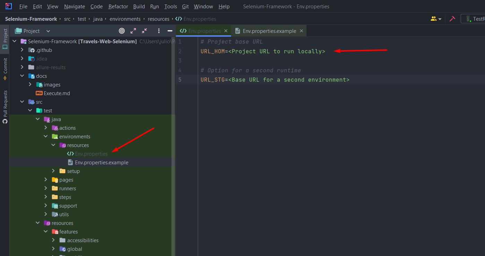

# Selenium-Cucumber-Java
- Este projeto foi criado para fins de estudo, seu foco está em criar um framework de automação E2E utilizando Selenium,
Cucumber e Java, e para a visualização do resultado da execução dos testes foi utilizado o Allure Report. O projeto foi
desenvolvido utilizando as boas práticas dos padrões Page Objects e Page Factory, e para exemplificar boas práticas de
segurança, a URL Base do projeto foi inserida em uma variável Secrets como um exemplo para guardar dados sensíveis. Para
execuções dos testes em CI foi utilizado o GitHub Actions, e para visualizar em tempo real o resultado dos testes,
foi implementado uma ação no github actions que irá publicar os resultados da execução em uma página estática no
Github Pages, é possível visualizar o resultado da última execução clicando <a href="https://juliosantosjob.github.io/Selenium-Cucumber-Java">aqui.</a>

<p>

## Execução do projeto local

- Para executar este projeto é necessário ter o JDK 11 ou superior instalado em sua máquina
  (Download: <a href="https://www.oracle.com/br/java/technologies/javase/jdk11-archive-downloads.html">
  Link</a>).

<p>

- Baixe a última versão do Maven
  (Download: <a href="https://maven.apache.org/download.cgi">
  Link</a>).

<p>

- Configure o JAVA_HOME e o MAVEN_HOME em sua maquina
  (Artigo de apoio para esta configuração:
  <a href="https://medium.com/beelabacademy/configurando-vari%C3%A1veis-de-ambiente-java-home-e-maven-home-no-windows-e-unix-d9461f783c26">
  Link</a>).

<p>

- Baixe e instale a IDE de sua preferência para rodar o projeto (eu utilizo o
  <a href="https://www.jetbrains.com/idea/download/#section=windows">
  IntelliJ</a>).

<p>

- Clone o projeto rodando o comando:

````
git clone https://github.com/juliosantosjob/Selenium-Cucumber-Java.git
````

<p>

- Abra o projeto pela IDE, vá até o arquivo pom.xml e clique no botão maven para instalar as dependências do projeto.

<p>


<p>

- No caminho <strong>"src/test/java/environments/resources"</strong> existe um arquivo chamado <strong>
  env.properties.example</strong>, ele serve como base para informar qual URL o teste deve apontar, então
  no lugar de <strong>env.properties.example</strong> crie um arquivo chamado <strong>env.properties
  </strong> e informe nele a url base utilizada para automação deste projeto que seria:
  <a href="http://automationpratice.com.br">
  SiteQazando</a>,
  (Esta url não foi adicionada ao código para exemplificar boas praticas utilizando o secrets do Github).

<p>

### Example:



<p>

### Parâmetros de execução.

(Obs: para informar um parâmetro é necessário passar o "-D" antes do que deseja informar).

<p>

- No parâmetro ENV você deve informar em qual ambiente deseja executar os testes, neste caso seria homologação
  (deixei a opção de stage para exemplificar caso houvesse um segundo ambiente).<p>
  example:<strong> -DENV=hmg</strong> ou <strong> -DENV=stg</strong>.
  para rodar o projeto no Github Actions é obrigatório passar: <strong>-DENV=hmg-actions</strong> ou <strong>
  -DENV=stg-actions</strong>

<p>

- No parâmetro BROWSER você pode escolher qual o navegador deseja para a execução, para informa-lo apenas passe o nome
  do navegador em caixa baixa,
  <p>example: <strong>-DBROWSER=chrome</strong> ou <strong>-DBROWSER=edge</strong>
  (Este projeto foi estruturado para rodar somente nos navegadores Chrome e Edge).

<p>

- Por fim, para instalar as dependências do projeto utilizando o Maven rode o comando:

````
 mvn install
````

- Se desejar executar o projeto utilizando o Maven, rode o comando:

````
 mvn test
````

<p>
   
### Ferramentas utilizadas para o desenvolvimento do projeto:
- Java
- JUnit
- Maven
- Selenium Webdriver
- Cucumber(BDD)/Gherkin
- Allure Report
- GH-Actions
- GH-Pages
   
 ### Minhas Redes
   [](https://www.linkedin.com/in/julio-santos-43428019b)
   [](https://www.instagram.com/juli0sts/)
   [](https://www.facebook.com/profile.php?id=100003793058455)
   <a href="mailto:julio958214@gmail.com">
   </a>
