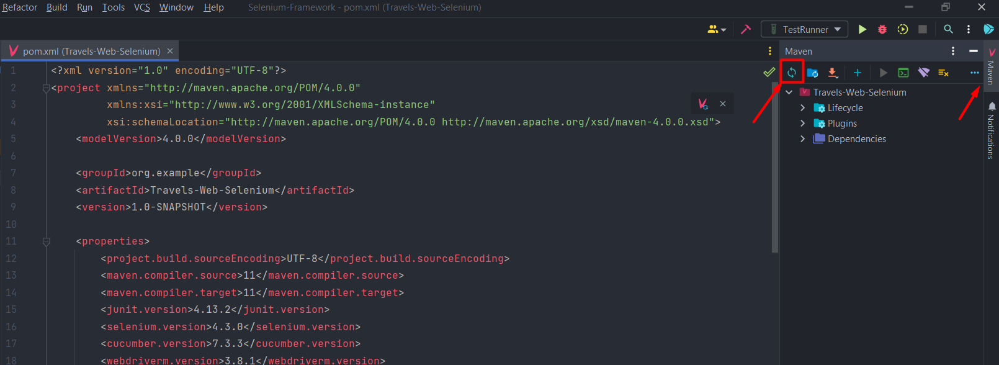
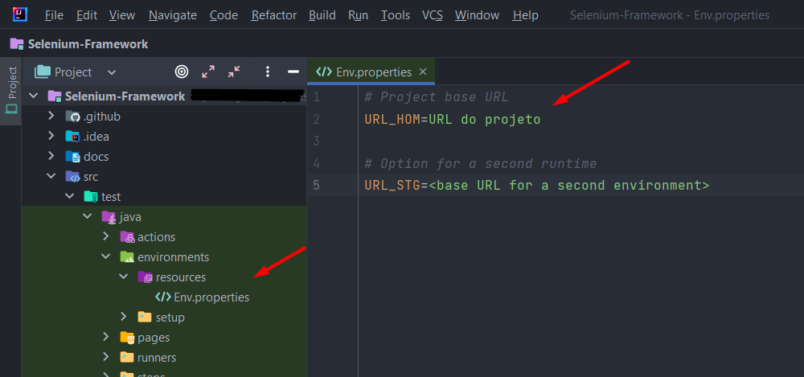
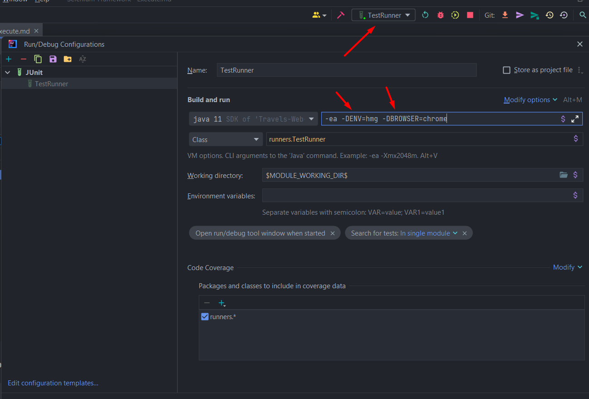

## Execução do projeto local

- Para executar este projeto é necessário ter o JDK 11 ou superior instalado em sua máquina.
  (Download: <a href="https://www.oracle.com/br/java/technologies/javase/jdk11-archive-downloads.html">
  Link</a>)

<p>

- Baixe o Maven na ultima versão.
  (Download: <a href="https://maven.apache.org/download.cgi">
  Link</a>)

<p>

- Configure o JAVA_HOME e o MAVEN_HOME em sua maquina.
  (Artigo de apoio para esta configuração:
  <a href="https://medium.com/beelabacademy/configurando-vari%C3%A1veis-de-ambiente-java-home-e-maven-home-no-windows-e-unix-d9461f783c26">
  Link</a>)

<p>

- Baixe e instale a IDE de sua preferência para rodar o projeto, eu utilizo o
  <a href="https://www.jetbrains.com/idea/download/#section=windows">
  IntelliJ</a>)

<p>

- Clone o projeto rodando o comando:

````
git clone https://github.com/juliosantosjob/Selenium-Framework.git
````

<p>

- Abra o projeto pela IDE, e vá até o arquivo pom.xml, clique no botão maven para instalar as dependências do projeto.

<p>



<p>

- No caminho <strong>"src/test/java/environments/resources"</strong> existe um arquivo chamado <strong>
  Env.properties.example</strong>, ele serve como base para informar qual URL o teste deve apontar, então
  no lugar de <strong>Env.properties.example</strong> crie um arquivo chamado <strong>Env.properties
  </strong> e informe nele a url base utilizada para automação deste projeto que seria:
  <a href="http://automationpratice.com.br/">
  SiteQazando</a>,
  (Esta url não foi adicionada ao código para exemplificar boas praticas utilizando o secrets do Github).

<p>

### Example:



- Agora vá até o caminho <strong>"src/test/java/runners/TestRunner.java"</strong> e execute a classe TestRunner, logo de
  início ele apresentará um erro, porém não tem problema, siga para o próximo passo.

<p>

- Em seguida vá até o <strong>"Select/Run"</strong> da IDE, clique em <strong>"Edit Configuration"</strong> e passe o
  seguinte
  comando:

````
 -ea -DENV=hmg -DBROWSER=chrome
````

<p>



<p>

### Parâmetros de execução.

(Obs: para informar um parâmetro é necessário passar o "-D" antes do que deseja informar).

<p>

- No parâmetro ENV você deve informar em qual ambiente deseja executar os testes, neste caso seria homologação
  (deixei a opção de stage para exemplificar caso houvesse um segundo ambiente).<p>
  example:<strong> -DENV=hmg</strong> ou <strong> -DENV=stg</strong>.
  para rodar o projeto no Github Actions é obrigatório passar: <strong>-DENV=hmg-actions</strong> ou <strong>
  -DENV=stg-actions</strong>

<p>

- No parâmetro BROWSER você pode escolher qual o navegador deseja para a execução, para informa-lo apenas passe o nome
  do navegador em caixa baixa,
  <p>example: <strong>-DBROWSER=chrome</strong> ou <strong>-DBROWSER=edge</strong>
  (Este projeto foi estruturado para rodar somente nos navegadores Chrome e Edge).

<p>

- Por fim, para instalar as dependências  do projeto utilizando o Maven rode o comando:

````
 mvn install -DENV=hmg -DBROWSER=chrome
````

- Se desejar executar o projeto utilizando o Maven, rode o comando:

````
 mvn test -DENV=hmg -DBROWSER=chrome
````
